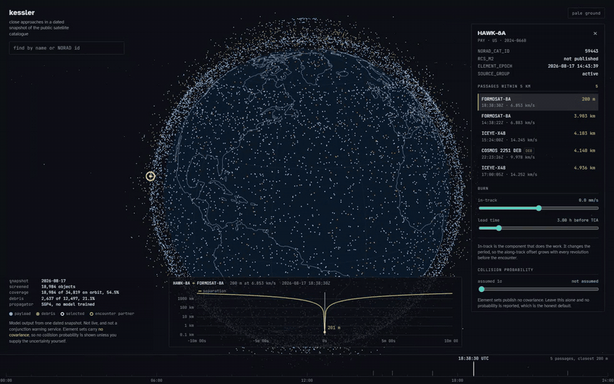

# kessler

Close approaches in a dated snapshot of the public satellite catalogue, and what a small burn does to one.

[](https://github.com/markolivaic/kessler/actions/workflows/ci.yml)

kessler propagates 18,983 catalogued objects with **SGP4**, finds every pair that comes
within 25 km of each other over 24 hours, throws out the pairs that only look close, and
lets you pick one encounter and push a satellite with a few centimetres per second to see
where it ends up instead. The globe shows the whole population moving. One time axis runs
the page.

**This is orbital mechanics. No model is trained here and none runs.** There is no
machine learning in this repository. The numbers are SGP4 propagation of published mean
elements and geometry on top of it.

## What this is NOT

**It is not live.** Everything comes from one snapshot, taken 2026-08-17 and committed
to this repository. CelesTrak's `robots.txt` disallows the element-set endpoint, so
nothing here fetches on a page load and the browser never contacts them at all.

**It does not see half the sky.** It screens **18,984 of the 34,819 objects the catalogue
lists as on orbit, 54.5%.** Payloads 82.4%, debris 21.1%, and rocket bodies **2 of 2,421**.
The full catalogue needs a Space-Track login, which would break clone-and-run. A close
approach this project does not report is not a close approach that did not happen.

**It computes no collision probability of its own.** Two-line element sets carry no
covariance. Where a probability appears you supplied the uncertainty, the assumed value
sits next to the number, and moving it changes the answer by orders of magnitude. That
is the point of showing it.

**It is not a conjunction warning service** and is not a reason to move a spacecraft.
The real ones screen the full tracked catalogue against observations that are not public.

## The measurement that came first

Before any interface existed, one question had to be answered: after filtering, is there
anything to show? `scripts/survey_conjunctions.py` propagates the snapshot for 24 hours
and counts. On this machine that is 164,032,103 state vectors and about 14 minutes.

| within | close approaches in 24 h | per object per day |
|---|---|---|
| 25 km | 1,525,863 | 161 |
| 10 km | 234,742 | 24.7 |
| **5 km** | **47,457** | **5.0** |
| 1 km | 772 | 0.081 |

The answer was not "three a week". It was the opposite problem: at 25 km almost
everything is a conjunction and the word stops meaning anything. **5 km is the threshold
the interface uses**, because there a satellite you pick averages 5 close approaches a
day, and of the 13,509 objects that see any, the median is 3 and the 95th percentile is
23. That is a list a person reads. At 1 km an object waits about twelve days for one.

Closest in the window: **ION SCV-004 and STARLINK-36519, 10.4 m apart at 11.4 km/s.**

```bash
python scripts/survey_conjunctions.py --hours 24 --step 10 --threshold 25
```

## Two ways a pair looks close without ever meeting

Both were found by reading real output, and both sit at the top of a naive result list
where they do the most damage.

**Unfiltered, the twenty closest approaches in this snapshot are the International Space
Station against its own docked vehicles, at exactly zero kilometres.** A station and
everything berthed to it are published on one element set, so SGP4 gives them one
identical trajectory. Three such groups exist here, of 11, 5 and 2 objects, which is
C(11,2) + C(5,2) + C(2,2) = **66 pairs** removed. The third group is Intelsat 10-02 and
the MEV-2 servicing vehicle docked to it.

The second class is bigger and is not about publishing at all. **1,080 pairs fly together
on purpose.** TanDEM-X is 7.6 km from TerraSAR-X at 9 m/s and has been for fifteen years.
The two halves of the TianHui 2 bistatic radar pair are 164 m apart at 0.8 m/s. PROBA-3
flies a coronagraph in two pieces. Intelsat 30 and 31 share a geostationary slot. At
those speeds there is no time of closest approach to find, only a flat basin an optimiser
picks a point out of, and no manoeuvre decision to make. The filter is relative speed
below 50 m/s, and the cut sits in a gap rather than through a population: measured here,
formations top out near 30 m/s and real passages start near 200 m/s.

How much the speed floor matters, from `data/survey/summary.json`:

| floor | ≤1 km | ≤5 km | ≤10 km | ≤25 km |
|---|---|---|---|---|
| none | 781 | 47,537 | 235,082 | 1,526,943 |
| 50 m/s, used | 772 | 47,457 | 234,742 | 1,525,863 |
| 200 m/s | 772 | 47,398 | 234,306 | 1,523,767 |

It changes the total by 0.07% and it changes the top of the list completely. That is the
shape of the whole problem.

## Which debris is here, and by what rule

> Every debris cloud CelesTrak publishes as a fetchable GROUP. All of them, no selection.

On 2026-08-18 that is three groups on their index page plus `cosmos-1408-debris`, which
is on no index page but still answers. A reader checks the rule in one request. The
binding constraint is availability, not size, and `scripts/debris_families.py` measures
what that costs from the committed SATCAT with no network:

| family | on-orbit fragments | why it is not here |
|---|---|---|
| CZ-6A | 1,206 | not one event. **8 separate launches** of the same upper stage, so there is no parent to name a group after |
| DELTA 1 | 954 | not one event, 35 launches |
| COSMOS 1275 | 402 | single breakup, no CelesTrak group |
| NOAA 16 | 356 | single breakup, no CelesTrak group |

One number is worth stopping on. **Cosmos 1408 produced over 1,500 tracked fragments in
2021 and 3 of them are left.** Fengyun 1C, nineteen years older and a comparable event,
still has 2,315. The 2021 test was conducted near 480 km where drag clears debris in a
few years; the 2007 one near 850 km where it does not. Altitude decides persistence more
than the size of the event does.

## Walkthrough

[](docs/walkthrough/app-walkthrough.mp4)

[Full-resolution H.264 recording](docs/walkthrough/app-walkthrough.mp4), and the
[poster frame](docs/walkthrough/app-walkthrough-poster.jpg).

One uninterrupted recording of the running application. It finds HAWK-8A, opens
its closest approach with FORMOSAT-8A at 200 m, and walks the in-track burn from
zero out to 20 mm per second and back through zero into a retrograde burn. The
teal curve is the refitted post-burn trajectory and it separates from the amber
one as the burn grows. Both directions increase the miss distance, which is what
the geometry requires. Every state transition is rendered by the running
application. No screen is mocked.

## Why this exists

The interesting part turned out not to be the speed, though the speed is what made it
findable. It was that **the filtering is the work.**

I expected to write a screen, look at the answer, and build an interface. What actually
happened is that the first result was dominated by things that are not conjunctions. The
space station against its own Progress. A radar satellite 164 m from its own twin. Once
those were gone the remaining number was so large that "conjunction" stopped being a
category and became a threshold you choose, and choosing it is a design decision that
decides what the interface can be.

That is the same shape as the last project, where the interesting question was not the
model but how much of the source database you could honestly hand to it. Here it is not
the propagator but which of 1.5 million geometric facts are about the sky rather than
about the catalogue's publishing conventions.

The speed matters because it is what let the question be asked at all. SGP4 does about
two million state vectors a second on one core, so the entire catalogue for a day is a
coffee break, not a cluster. There is no GPU anywhere in this project and no training
step. Being able to rerun the whole measurement after every change to the filter is why
the filter got two rules instead of one.

The user I had in mind is a university or small-company cubesat operator who receives a
conjunction warning from the 18th Space Defense Squadron, cannot afford commercial space
situational awareness tooling, and has no way to ask *what does a 5 cm/s burn tomorrow do
to this*. That question is the whole interface.

## How it works

```
snapshot on disk ──> catalogue.py ──> screening.py ──────> conjunctions.csv
  gp-*.csv              parse,          gate, KD tree,       (committed)
  satcat.csv            SATCAT join     linear TCA test,          │
                             │          SGP4 minimise            │
                             │                                    v
                             └──────> artefacts.py ──────>  api.py ──> browser
                                      two predicates          │        globe,
                                                              │        spine,
                                          manoeuvre.py <──────┘        curve
                                          invert SGP4,
                                          re-propagate
```

| file | what it is responsible for |
|---|---|
| `backend/kessler/catalogue.py` | reading a snapshot, joining SATCAT, reporting coverage |
| `backend/kessler/screening.py` | the gate, the three passes, the separation curve |
| `backend/kessler/artefacts.py` | the two predicates, each returning a reason rather than a boolean |
| `backend/kessler/manoeuvre.py` | inverting SGP4 so a burn can be propagated by SGP4 |
| `backend/kessler/probability.py` | Pc, and refusing to invent the covariance it needs |
| `backend/kessler/tle.py` | re-encoding element sets as TLE text for the browser |
| `backend/kessler/api.py` | the HTTP surface |
| `web/src/globe.ts` | graticule, coastline, 19,000 points |
| `web/src/spine.ts` | the time axis and the separation curve under it |
| `web/src/propagate.ts` | SGP4 in the browser, tested without one |
| `scripts/survey_conjunctions.py` | the measurement above |

### The screen is exhaustive, and that is checked

The property everything rests on: at the sample nearest a close approach, two objects are
at most the threshold plus the furthest they can close in half a step apart. Screen at
that radius and nothing below the threshold can hide between samples. The radius is
derived from the catalogue rather than chosen: twice the fastest perigee speed in the
file, 21.93 km/s here, over half a 10 s step, so **134.6 km** at a 25 km threshold.

`tests/unit/test_screening.py` checks that against an independent reference that uses no
optimiser at all, over a 380-object slice of the 540 to 570 km shell: **0 missed, 0
extra**, worst distance disagreement 2.6 m.

### A burn has to be propagated by the same physics

SGP4 does not take state vectors. It takes mean elements, and the osculating elements of
a post-burn state are not those. The usual dodge is to propagate the manoeuvred object
with a two-body or J2 model while the other object stays on SGP4, which quietly compares
two different physics and puts the difference in the answer.

So `manoeuvre.py` inverts SGP4 instead, by fixed point in equinoctial elements. Classical
elements have two singularities and the catalogue sits on both: at zero eccentricity the
perigee is undefined, at zero inclination the node is. Correcting those angles separately
made the iteration oscillate, which is exactly what it did, leaving 38 m of error on
near-circular low orbits and 16 km on a geostationary one. Equinoctial elements have
neither singularity. Deep-space element sets still resist the fixed point, so those fall
back to a proper least-squares solve with a numerical Jacobian.

Measured over **every object in the catalogue** with a **zero** burn, which makes the
residual the accuracy floor of every manoeuvre answer: median **9.1e-08 m**,
**99.9473%** under one micrometre, 0.923 ms per inversion.
**10 objects do not converge**, all geostationary, and the API returns
422 for those rather than a plausible wrong number. One further object is refused by SGP4
itself and cannot be manoeuvred from at all.

That paragraph used to say two objects and quote a 198-object sample. Both were wrong,
and for the same reason: the least-squares fallback returned three values into a two
value unpacking, so it raised on every object that reached it. The sweep caught the
exception and counted those as skips, so the objects that needed the fallback were
exactly the ones excluded from the measurement. Fixing it moved 211 crashes to 0.

The browser side is plain TypeScript on Vite with three.js and satellite.js. No
framework: one route, one canvas, and a clock that drives every panel. Putting a
reconciler between the propagator and the renderer would cost a frame budget it
cannot repay.

## Quick start

Needs Python 3.11+ and Node 22+. No API key. No account. The snapshot is in the repo, so
it works offline.

```bash
git clone https://github.com/markolivaic/kessler && cd kessler
```

**Backend**

```bash
python -m venv .venv
```

```bash
.venv/Scripts/python -m pip install -e "backend[dev]"   # Windows
```

```bash
.venv/bin/python -m pip install -e "backend[dev]"       # Linux and macOS
```

```bash
.venv/Scripts/python -m uvicorn kessler.api:app --port 8000 --app-dir backend
```

**Frontend**, in a second terminal:

```bash
npm --prefix web ci && npm --prefix web run dev
```

Open `http://localhost:5173`. The dev server proxies `/api` to port 8000.

## API

| route | what it gives you |
|---|---|
| `GET /api/provenance` | snapshot date, coverage, and what this is not |
| `GET /api/catalogue` | every object as parallel arrays |
| `GET /api/catalogue.tle` | the same, as TLE text, because satellite.js reads nothing else |
| `GET /api/object/{norad}` | one object's record and its passages under 5 km |
| `GET /api/encounter?a=&b=&tca_offset_s=` | the separation curve through one approach |
| `POST /api/manoeuvre` | apply a burn, get the new miss distance and the inversion residual |
| `GET /api/artefacts` | everything that was filtered, and why |

## Verification

Produced on Windows AMD64, AMD Ryzen, Python 3.12.1, numpy 2.5.2, on 2026-08-18.

| check | command | result |
|---|---|---|
| Behavioural tests | `pytest tests/unit` | 74 passed |
| Frontend tests | `npm --prefix web test` | 33 passed |
| Integrity tests | `pytest tests/integrity` | 37 passed |
| The survey | `python scripts/survey_conjunctions.py` | 1,525,863 within 25 km, 47,457 within 5 km |
| SGP4 throughput | `python scripts/benchmark.py` | 2,357,791 state vectors/s |
| SGP4 inversion floor | `python scripts/benchmark.py` | median 9.1e-08 m over all 18,983, 0.923 ms |
| Debris family ranking | `python scripts/debris_families.py` | 12,497 on-orbit debris in 432 families |

```
Behavioural tests: 74   (pytest tests/unit)
Integrity tests:   37   (pytest tests/integrity)
Frontend tests:    33   (vitest, in web/)
```

Counted separately on purpose. The integrity ones are document and contract guards, not
behaviour, and folding them into one number would inflate it.

**Determinism.** The survey was run three times, twice on numpy 2.2.6 with scipy 1.16.3
and once on numpy 2.5.2 with scipy 1.18.0, and produced identical counts and percentiles
every time.

## Limitations and failure modes

- **Half the catalogue is missing**, quantified above. Rocket bodies are the largest hole
  at 2 of 2,421, and they are large uncontrolled objects that matter.
- **CelesTrak's `robots.txt` disallows the element-set endpoint** for every agent. That is
  why a dated snapshot is committed instead of fetched live, why the app never calls them
  from a browser, and why `scripts/fetch_snapshot.py` is a manual one-shot tool with no
  cron behind it. Measured from the snapshot: **not one of 16,344 element sets was fresher
  than two hours**, median age 16.1 h, so a frequent refresh would buy nothing anyway. If
  CelesTrak ask for the snapshot to come down, it comes down. Anyone who needs live data
  should use Space-Track directly, which permits programmatic access to account holders;
  kessler does not, because an account would break clone-and-run and this is an analysis
  of a dated snapshot rather than a tracker.
- **SGP4 is a model with no error bars.** A 10 m predicted miss distance is not a claim
  that two objects passed 10 m apart. Real position error for a public element set is
  routinely hundreds of metres to kilometres, which is larger than most of the miss
  distances at the top of the list.
- **The 5 km threshold is a choice**, defended by the per-object numbers above and by
  nothing else.
- **The co-orbiting filter will remove a real slow conjunction** if one ever happens below
  50 m/s. The sensitivity table shows what that costs.
- **The globe is less precise than the readout.** The browser propagates from TLE text,
  which costs a median of 0.27 m and at worst 83 m of position over 24 hours against the
  full-precision elements. Every number in the interface comes from the server.
- **10 geostationary objects cannot be manoeuvred**, because the SGP4
  inversion does not converge for them. The API refuses rather than answering.
- **The snapshot ages.** Element sets from 2026-08-17 are not useful for operations now
  and were never intended to be.

## References

- Vallado, Crawford, Hujsak, Kelso, *Revisiting Spacetrack Report #3*, AIAA 2006-6753.
- Hoots, Crawford, Roehrich, *An analytic method to determine future close approaches
  between satellites*, Celestial Mechanics 33, 1984. The perigee/apogee filter.
- Foster and Estes, *A parametric analysis of orbital debris collision probability and
  manoeuvre rate for space vehicles*, NASA JSC-25898, 1992. The encounter-plane method.
- Kessler and Cour-Palais, *Collision frequency of artificial satellites*, JGR 83, 1978.

These references motivate the design; they do not validate the numbers here.

## Licence

MIT, see `LICENSE`. The catalogue data is not mine and is covered separately in
`THIRD_PARTY_NOTICES.md`.
